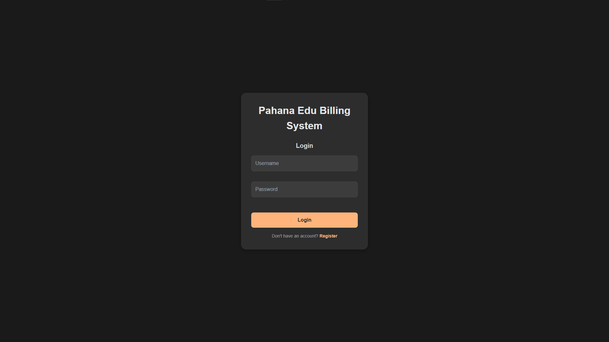
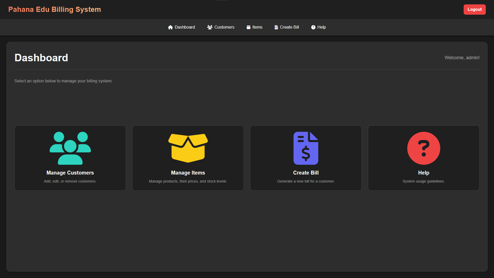
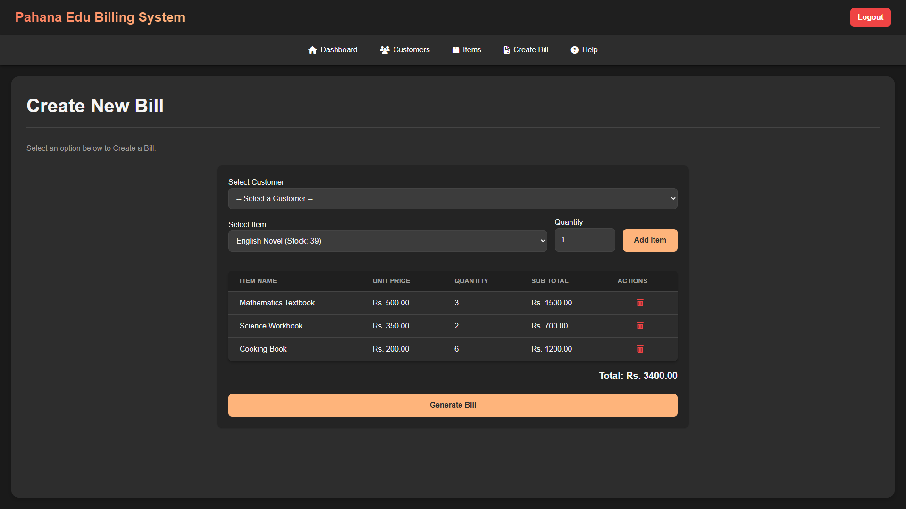

# Pahana Edu Billing System


---

## 🌌 Overview

**Pahana Edu Billing System** is a web-based application. Built using Java, JSP, and MySQL, it offers a secure, user-friendly interface for managing customers, inventory, and billing operations with a modern and responsive design.

---

## 📸 Screenshots






---

## ✨ Key Features

- **User Authentication**: A secure registration and login system with password hashing.
- **Dashboard**: Centralized hub for seamless navigation to all core functionalities.
- **Customer Management**: Comprehensive CRUD (Create, Read, Update, Delete) operations for managing customer records.
- **Inventory Management**: Real-time inventory tracking with CRUD capabilities for products, unit prices, and stock levels.
- **Bill Generation**: An automated billing module that generates detailed, multi-item bills, calculates totals, and updates stock quantities instantly.
- **Bill Viewing & Printing**: Features for displaying and printing professionally formatted bills for both digital and physical records.

---

## 🛠️ Technology Stack

- **Backend**: Java, jBCrypt
- **Frontend**: JSP, HTML, CSS
- **Database**: MySQL
- **Build Tool**: Maven
- **Server**: Apache Tomcat 11

---

## ⚙️ Setup Instructions

This guide provides a step-by-step process for setting up and running the project within IntelliJ IDEA, using Apache Tomcat 11, OpenJDK 24, and a MySQL database.

### Prerequisites

- **[IntelliJ IDEA](https://www.jetbrains.com/idea/) (Ultimate Edition)**
- **[MySQL](https://dev.mysql.com/downloads/installer/)**
- **[Apache Tomcat 11](https://tomcat.apache.org/download-11.cgi)**
- **OpenJDK 24 or compatible version**

---

### 1. Project Setup
1. **Download the [Latest Release](https://github.com/Tr3vins/PahanaEduBillingSystem/releases).**


2. **Extract the contents of the ZIP file to a preferred location on your computer.**


3. **Open IntelliJ IDEA and select Open from the welcome screen.**


4. **Navigate to the extracted project folder and click OK. IntelliJ will import the project.**

### 2. Database Configuration

Execute the following SQL script in your MySQL client to set up the database and required tables:

```sql
-- Database Creation
DROP DATABASE IF EXISTS pahana_edu_db;
CREATE DATABASE pahana_edu_db;
USE pahana_edu_db;

-- 1. Users Table for Authentication
CREATE TABLE IF NOT EXISTS users (
    user_id INT AUTO_INCREMENT PRIMARY KEY,
    username VARCHAR(50) NOT NULL UNIQUE,
    password_hash VARCHAR(255) NOT NULL,
    role VARCHAR(50) DEFAULT 'admin',
    created_at TIMESTAMP DEFAULT CURRENT_TIMESTAMP
);

-- 2. Customers Table
CREATE TABLE IF NOT EXISTS customers (
    account_number VARCHAR(20) PRIMARY KEY,
    name VARCHAR(100) NOT NULL,
    address VARCHAR(255),
    telephone_number VARCHAR(20),
    registration_date TIMESTAMP DEFAULT CURRENT_TIMESTAMP
);

-- 3. Items Table
CREATE TABLE IF NOT EXISTS items (
    item_id INT AUTO_INCREMENT PRIMARY KEY,
    item_name VARCHAR(100) NOT NULL UNIQUE,
    unit_price DECIMAL(10, 2) NOT NULL,
    stock_quantity INT NOT NULL DEFAULT 0,
    CHECK (unit_price >= 0),
    CHECK (stock_quantity >= 0)
);

-- 4. Bills Table
CREATE TABLE bills (
    bill_id INT AUTO_INCREMENT PRIMARY KEY,
    account_number VARCHAR(20) NOT NULL,
    bill_date TIMESTAMP DEFAULT CURRENT_TIMESTAMP,
    FOREIGN KEY (account_number) REFERENCES customers(account_number)
);

-- 5. BillItems Table
CREATE TABLE bill_items (
    bill_item_id INT AUTO_INCREMENT PRIMARY KEY,
    bill_id INT NOT NULL,
    item_id INT NOT NULL,
    item_name VARCHAR(255) NOT NULL,
    unit_price DOUBLE NOT NULL,
    quantity INT NOT NULL,
    sub_total DOUBLE NOT NULL,
    FOREIGN KEY (bill_id) REFERENCES bills(bill_id),
    FOREIGN KEY (item_id) REFERENCES items(item_id)
);
```

### 3. Database Connection Setup

Update the database credentials in IntelliJ IDEA under `src/main/java/com/pahanaedu/util/DBConnection.java` to match your MySQL configuration:

```java
// src/main/java/com/pahanaedu/util/DBConnection.java
private static final String JDBC_URL = "jdbc:mysql://localhost:3306/pahana_edu_db?useSSL=false";
private static final String JDBC_USERNAME = "root"; // Replace with your MySQL username
private static final String JDBC_PASSWORD = "pass"; // Replace with your MySQL password
```

### 4. Configure IntelliJ IDEA and Tomcat
1. In IntelliJ IDEA, go to **File > Project Structure** (`Ctrl+Alt+Shift+S`).


2. Under **Project Settings**, select **Project.**


3. Set the **Project SDK** to your installed `OpenJDK 24`.


4. Next, under **Platform Settings**, select **Artifacts.**


5. If an artifact is not already created, click the + button, select **Web Application: Exploded > From Modules**, and choose the main project module.


6. The default settings should be fine, but make sure the **Output directory** is set to a valid location.

### 5. Add and Configure the Tomcat Server
1. Go to **Run > Edit Configurations.**


2. Click the `+` icon in the top-left corner and select **Tomcat Server > Local.**


3. In the configuration dialog:
   - Under **Application Server**, click **Configure.** 
   - Browse to the root directory where you extracted Apache Tomcat 11. 
   - Set the **HTTP port** `8080`.


4. Next, switch to the **Deployment** tab.


5. Click the `+` button and select **Artifact > PahanaEduBillingSystem:war exploded.**


6. Change the **Application context** below to `/PahanaEduBillingSystem` or simply `/`.


7. Click **Apply** and **OK.**

### 6. Run the Application `▷`️

---

## 📁 Project Structure

```
PahanaEduBillingSystem/
├── src
│   └── main
│       ├── java/com/pahanaedu
│       │   ├── dao       # Data Access Objects for database operations
│       │   ├── filter    # Servlet filters for request processing
│       │   ├── model     # Data models for entities
│       │   ├── servlet   # Servlets for handling requests
│       │   └── util      # Utility classes for shared functionality
│       └── webapp
│           ├── css/      # custom styles
│           ├── WEB-INF/  # web.xml
│           └── *.jsp     # JSP view files
│
└── pom.xml               # Maven configuration file
```

---

## 🔮 Future Roadmap

The following enhancements are planned to further improve the Pahana Edu Billing System:

- **Advanced Reporting**: Implement detailed analytics and reporting features, including sales trends, inventory status, and customer insights.
- **Cloud Deployment**: Add support for deployment on cloud platforms like AWS, Azure, or Google Cloud for improved scalability.
- **Mobile Application**: Develop native iOS and Android apps for on-the-go access to billing and inventory management.
- **Automated Notifications**: Introduce email and SMS notifications for bill generation, payment reminders, and low-stock alerts.
- **Internationalization**: Support multiple languages and currencies to cater to a global user base.

---

## 🤝 Contributing

We welcome contributions to enhance the Pahana Edu Billing System. To contribute:

1. Fork the repository.
2. Create a feature branch (`git checkout -b feature/YourFeature`).
3. Commit your changes (`git commit -m 'Add YourFeature'`).
4. Push to the branch (`git push origin feature/YourFeature`).
5. Submit a pull request for review.

Please ensure your code adheres to the project's coding standards and includes appropriate documentation.

---

## 📄 License

This project is licensed under the MIT License:

```
MIT License

Copyright (c) 2025 Pahana Edu Billing System

Permission is hereby granted, free of charge, to any person obtaining a copy
of this software and associated documentation files (the "Software"), to deal
in the Software without restriction, including without limitation the rights
to use, copy, modify, merge, publish, distribute, sublicense, and/or sell
copies of the Software, and to permit persons to whom the Software is
furnished to do so, subject to the following conditions:

The above copyright notice and this permission notice shall be included in all
copies or substantial portions of the Software.

THE SOFTWARE IS PROVIDED "AS IS", WITHOUT WARRANTY OF ANY KIND, EXPRESS OR
IMPLIED, INCLUDING BUT NOT LIMITED TO THE WARRANTIES OF MERCHANTABILITY,
FITNESS FOR A PARTICULAR PURPOSE AND NONINFRINGEMENT. IN NO EVENT SHALL THE
AUTHORS OR COPYRIGHT HOLDERS BE LIABLE FOR ANY CLAIM, DAMAGES OR OTHER
LIABILITY, WHETHER IN AN ACTION OF CONTRACT, TORT OR OTHERWISE, ARISING FROM,
OUT OF OR IN CONNECTION WITH THE SOFTWARE OR THE USE OR OTHER DEALINGS IN THE
SOFTWARE.
```

---

## 📧 Contact

For questions or support, please contact the project maintainers at [support@pahanaedu.com](mailto:support@pahanaedu.com).

---

<div align="center">
  <p>© 2025 Pahana Edu Book Shop. All rights reserved.</p>
</div>